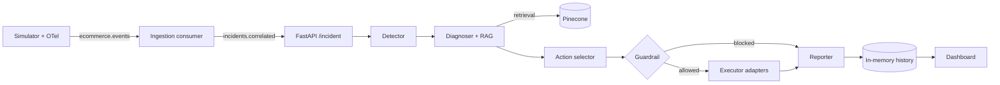

# Autonomous Incident Resolution (AIOps)

Event-driven agent platform that ingests streaming telemetry, diagnoses incidents with an LLM + RAG over internal runbooks, and executes remediations **only when deterministic guardrails approve the action**. Built to explore the problem space of running LLM-driven automation in the blast radius of production: destructive actions are gated by policy that lives outside the model, retrieval feeds are bounded by a similarity threshold, and every tool call has the same async shape as a real integration so the executor layer is swappable.

Stack: **Python 3.11 · FastAPI · asyncio · aiokafka · LangGraph · OpenAI · Pinecone · OpenTelemetry · Docker Compose**.

## Why this exists

Observability makes failure **visible** but not **resolved**. Most production incident work is pattern-matching signals against runbooks a human read last quarter, then running three commands. That loop fits an agent — provided you can keep the agent from running the wrong three commands. This project is a study of the plumbing and guardrails around doing that safely end-to-end: not a product, not a framework, a reference implementation.

## What the system does

1. **Ingests** logs, metrics, and trace-linked events in near real time over Kafka (Kinesis/MSK drop-in at the adapter layer).
2. **Correlates** raw events by `trace_id` in an async consumer and publishes batched incidents to a second topic.
3. **Diagnoses** with an LLM over RAG context — runbook markdown is chunked, embedded with `text-embedding-3-small`, and retrieved from Pinecone with a cosine-distance threshold. Weak retrieval is a first-class signal: the graph branches on `no_runbook_match` and refuses to propose destructive actions without evidence.
4. **Orchestrates agents** with LangGraph as an explicit state machine: `detector → diagnoser → action_selector → guardrail → (executor | reporter)`. Structured output (Pydantic) at every LLM boundary — no free-form parsing.
5. **Acts** through a tool registry (`rollback`, `restart_service`, `scale_up`, `create_pr_fix`, `noop`) — see "Executor design" below for why they're mocked and what makes that a feature, not a limitation.

## Executor design: mock tools, real contract

The executor layer (`agents/tools.py`) ships as a set of **adapter stubs** that log structured intent and return the same async signature a real integration would. This is deliberate.

- **The contract is the point.** The graph doesn't know or care whether `rollback(service, target_revision)` talks to ArgoCD, a GitHub revert PR, or a Kubernetes Deployment rollout. Swapping `rollback` for a real client is a ten-line change localised to one module; nothing above the executor needs to know.
- **Local-first demos are safe.** You can run the full pipeline against your machine without accidentally paging a team, rolling a real service, or opening a real PR.
- **Structured intent is auditable.** Every tool emits a JSON log line of what it *would* have done. That's what you'd feed into a review UI or a post-incident report.

Concretely, moving to a production executor looks like this:

```python
# Before (mock)
async def rollback(service: str, target_revision: str) -> str:
    _log_tool("rollback", service=service, target_revision=target_revision)
    return "rollback scheduled (mock)"

# After (example — ArgoCD)
async def rollback(service: str, target_revision: str) -> str:
    async with argocd_client() as client:
        await client.rollback_application(name=service, revision=target_revision)
    return f"rollback to {target_revision} dispatched"
```

The graph, guardrails, telemetry, and tests stay untouched.

## Guardrails (deterministic policy outside the model)

Policy is not a prompt. `agents/guardrails.py` is ~20 lines of pure Python:

```python
def validate_action(action):
    destructive = bool(action.get("destructive"))
    confidence = float(action.get("confidence", 0.0))
    if destructive and confidence <= 0.85:
        return {"blocked": True, "reason": "destructive actions require confidence > 0.85", ...}
    return {"blocked": False, ...}
```

The LLM self-reports `destructive` and `confidence` via structured output; the guardrail then decides. The rule is trivial on purpose — it's auditable, unit-testable, and cannot be prompt-injected out of existence. Extending this into a real policy engine (allow-lists per environment, time-of-day constraints, human-in-the-loop for change windows) is additive.

## Offline heuristic mode

Without `OPENAI_API_KEY` or `PINECONE_API_KEY`, the graph still runs. The diagnoser falls back to a classification-only narrative, and the action selector uses a deterministic mapping from detector class to tool. This makes the repo explorable without any cloud dependency and provides a clean control against the LLM path.

## Sample run

### Scenario A — destructive action blocked by guardrail

Request:

```bash
curl -s -X POST http://localhost:8000/incident \
  -H "Content-Type: application/json" \
  -d '{"title":"checkout error rate jumped","signals":{"error_rate":0.22,"service":"checkout"}}' | jq .
```

Response (offline mode, keys unset):

```json
{
  "duration_ms": 14,
  "title": "checkout error rate jumped",
  "signals": {"error_rate": 0.22, "service": "checkout"},
  "graph": {
    "detector": {"classification": "high_error_rate", "severity_hint": "high"},
    "diagnosis": {
      "narrative": "OpenAI disabled — heuristic diagnosis from signals and class only (no LLM).",
      "suspected_root_cause": "high_error_rate",
      "matched_runbook_titles": [],
      "no_runbook_match": false
    },
    "action": {
      "action": "rollback",
      "params": {"service": "checkout", "target_revision": "stable-1"},
      "destructive": true,
      "confidence": 0.7,
      "rationale": "Heuristic rollback for error/deploy class (expected to be blocked if confidence low)."
    },
    "guardrail_result": {
      "blocked": true,
      "reason": "destructive actions require confidence > 0.85",
      "destructive": true,
      "confidence": 0.7
    },
    "report": "Incident <uuid>: blocked by guardrails (destructive actions require confidence > 0.85). Proposed action=rollback destructive=True confidence=0.7 ..."
  }
}
```

The rollback never reached the executor. The guardrail intercepted it, the reporter logged the refusal, and the dashboard will show `blocked` in the Guardrail column.

### Scenario B — non-destructive action executes

```bash
curl -s -X POST http://localhost:8000/incident \
  -H "Content-Type: application/json" \
  -d '{"title":"checkout latency spike","signals":{"p95_ms":4200,"service":"checkout"}}' | jq '.graph | {action, guardrail_result, report}'
```

```json
{
  "action": {"action": "scale_up", "params": {"service": "checkout", "replicas": 5}, "destructive": false, "confidence": 0.72},
  "guardrail_result": {"blocked": false, "reason": "ok"},
  "report": "Incident <uuid>: executed scale_up -> scale-up applied (mock). Diagnosis: ..."
}
```

Same graph, same guardrail — `destructive=false` means low confidence is acceptable.

## Architecture



| Area | In this repo | Typical production extension |
|------|--------------|------------------------------|
| Streaming | Kafka (Docker Compose), `aiokafka`, trace-id correlation | Amazon MSK, Kinesis, Confluent Cloud |
| Orchestration | LangGraph state machine, async nodes | AWS Step Functions for long-running or human-in-the-loop sagas |
| AI | OpenAI + Pinecone serverless, cosine threshold on retrieval | Azure OpenAI, OpenSearch, Bedrock |
| Executor | Mock adapters, same async signatures as real clients | ArgoCD / K8s Python client / GitHub API / PagerDuty |
| Observability | OpenTelemetry (console + optional OTLP) | OTLP → Grafana / Honeycomb / X-Ray |
| Policy | Deterministic Python guardrail | OPA / Cedar for allow-lists, change-window, approver rules |

## What's non-obvious / what I'd call out in a review

- **The diagnoser never trusts retrieval blindly.** If cosine distance to the best match exceeds `RAG_MATCH_DISTANCE_MAX` (default `0.45`), `no_runbook_match` is set and the action selector is instructed to prefer `create_pr_fix` or `noop` over destructive tools. Bad retrieval → human follow-up, not a guessed rollback.
- **Structured output is load-bearing.** The LLM emits `ActionLLM` / `DiagnosisLLM` Pydantic models via `with_structured_output`. A malformed response is a validation error, not a downstream crash.
- **The guardrail uses the model's *self-reported* confidence.** That's fine as long as the policy is strict (>0.85) and destructive actions are a small, enumerated set. A production version would back the confidence with independent signals (e.g. agreement between retrieved runbook and detector class) rather than trust the LLM alone — the shape of that check is the obvious next iteration.
- **The dashboard is intentionally minimal.** Vanilla HTML/JS polling `/metrics/summary` and `/incidents` every 8 seconds. No build chain, no React — the surface area being shown off is the backend pipeline, not the frontend.

## Requirements

- Python 3.11+
- Docker + Docker Compose (Kafka + Zookeeper)
- OpenAI API key (LLM + embeddings) — optional, graph falls back to offline heuristics
- Pinecone API key + index — optional, same fallback behaviour

## Setup

```bash
cd aiops-platform
cp .env.example .env          # edit OPENAI_API_KEY / PINECONE_* if you want the LLM path
python3 -m venv .venv && source .venv/bin/activate
pip install -r requirements.txt
docker compose up -d          # Kafka + Zookeeper
python -m knowledge.indexer   # only if PINECONE_API_KEY is set
```

## Running locally

Three processes, each in its own terminal with the venv active:

| # | Command | Role |
|---|---------|------|
| 1 | `uvicorn simulator.ecommerce_app:app --port 8010 --reload` | Synthetic checkout traffic + OTel + Kafka producer |
| 2 | `python -m ingestion.consumer` | Kafka consumer, trace-id correlation, publishes `incidents.correlated` |
| 3 | `uvicorn api.main:app --port 8000 --reload` | Control API (graph trigger + history) |

Dashboard: open `dashboard/index.html` directly or serve the folder (`python -m http.server 3000` from inside). `API_BASE` defaults to `http://localhost:8000`.

## HTTP API

- `GET /health` — liveness
- `POST /incident` — body: `{ "title": string, "signals": object }`, returns the full graph state
- `GET /incidents` — history (newest first)
- `GET /metrics/summary` — `{ count, mttr_ms_avg, blocked_rate }`

## Kafka topics

- `ecommerce.events` — raw events from the simulator
- `incidents.correlated` — correlated batches keyed by `trace_id`

Override via `.env`: `KAFKA_TOPIC_EVENTS`, `KAFKA_TOPIC_CORRELATED`, `KAFKA_BOOTSTRAP_SERVERS`, `CORRELATION_FLUSH_EVENTS`.

## Status & roadmap

Reference implementation, actively evolving. Current priorities:

1. **Guardrail truth-table unit tests** — covering the destructive × confidence matrix and the edge case at `0.85` exactly (strict `>`).
2. **Graph-level integration test** — walks `detector → reporter` with stubbed retrieval, asserting the `no_runbook_match` branch and the blocked-path routing.
3. **First real executor adapter** — ArgoCD or a GitHub revert PR, to validate the adapter-swap claim on a concrete integration.
4. **Confidence corroboration** — back the LLM's self-reported confidence with an independent signal (agreement between retrieved runbook source and detector class) before the guardrail accepts it.
