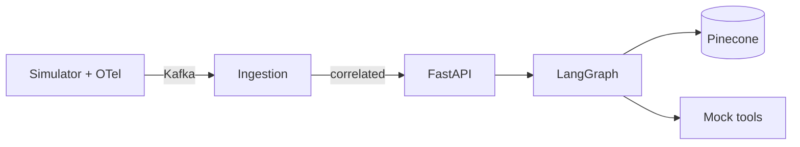

# Autonomous Incident Resolution (AIOps)

Distributed autonomous agent system for an e-commerce platform under revenue pressure during traffic spikes: **lower MTTR**, **fewer manual bridges**, and **more incidents closed without humans** by combining streaming telemetry, **RAG over internal runbooks**, and **LangGraph** orchestration with **guardrails** before any destructive action.

In this reference implementation, remediation tools are **mocked** (safe to run locally) while the ingestion, correlation, RAG, and agent flow mirror a production design.

## Real problem

Incidents (downtime, errors, tail latency) cost real money. Observability (logs, metrics, traces) makes failure **visible**; it does not by itself **resolve** failure. This project closes that gap with event-driven ingestion, diagnosis, and gated automation.

## What the system does

1. **Ingest** logs, metrics, and trace-linked events in near real time (**Kafka** in this repo; **Kinesis** is the common AWS analogue).
2. **Correlate** signals by `trace_id` before diagnosis.
3. **Diagnose** with an LLM plus **RAG** over internal runbooks (**Pinecone** + **OpenAI**; Azure OpenAI is a drop-in swap at the LangChain layer).
4. **Orchestrate agents** (**LangGraph**): detect → diagnose → choose action → **guardrail** → execute (mock) → report.
5. **Act** on playbooks: rollback, restart, scale, open a fix PR — with **rule-based guardrails** so `destructive=true` actions require **confidence > 0.85**.

## Technologies

| Area | In this repository | Typical production extension |
|------|----------------------|-------------------------------|
| Backend | **Python**, **FastAPI**, **asyncio** | Same services behind a load balancer |
| Streaming | **Kafka** (Docker Compose) | **Amazon MSK**, **Kinesis**, Confluent Cloud |
| Observability | **OpenTelemetry** (simulator + optional OTLP) | OTLP to Grafana / Honeycomb / X-Ray |
| Orchestration | **LangGraph** | **AWS Step Functions** for long-running, human-in-the-loop, or cross-account workflows |
| Compute | Long-lived **uvicorn** workers | **AWS Lambda** for burst handlers + Step Functions for sagas |
| AI | **OpenAI** + **Pinecone** | Azure OpenAI, OpenSearch Serverless, etc. |
| Architecture | Modular packages (`ingestion`, `agents`, `knowledge`, `api`) | **Hexagonal** ports/adapters; **CQRS** for separating incident command paths from historical reads |

## Challenges highlighted

- **Distributed consistency**: correlation windowing and idempotent consumers (Kafka consumer group in this repo).
- **Safety**: deterministic **guardrails** on top of LLM proposals.
- **Inference cost / tail latency**: small models for routing; retrieval constrained to top‑k chunks; async end-to-end.
- **Correlation**: unify logs + metrics + traces on a shared **trace_id**.

## Impact metrics (what you optimize for)

| Metric | Direction you want |
|--------|--------------------|
| MTTR | ↓ |
| Manual incident volume | ↓ |
| Tail latency (p99) for critical paths | ↓ (improved performance) |
| Auto-resolved critical incidents | ↑ % |

## Requirements

- **Python 3.11+** (3.9 may work but 3.11+ is what this README is written for)
- **Docker** + Docker Compose (Kafka + Zookeeper)
- **OpenAI** API key (LLM + embeddings for RAG)
- **Pinecone** API key and index (runbook indexing + retrieval). Without keys, the graph still runs using **offline heuristics** (no cloud RAG).

## Setup

```bash
cd aiops-platform
cp .env.example .env
# Edit .env: OPENAI_API_KEY, PINECONE_* , KAFKA_BOOTSTRAP_SERVERS (default localhost:9092)
python3 -m venv .venv
source .venv/bin/activate          # Windows: .venv\Scripts\activate
pip install -r requirements.txt
docker compose up -d
```

Index runbooks into Pinecone (creates serverless index if missing):

```bash
python -m knowledge.indexer
```

## Operating the stack (local)

Run these in **separate terminals** from `aiops-platform` with the venv activated:

| Step | Command | Role |
|------|---------|------|
| 1 | `uvicorn simulator.ecommerce_app:app --host 0.0.0.0 --port 8010 --reload` | Fake checkout + OTel + Kafka producer |
| 2 | `python -m ingestion.consumer` | Async consumer: normalize → correlate by `trace_id` → publish `incidents.correlated` |
| 3 | `uvicorn api.main:app --host 0.0.0.0 --port 8000 --reload` | Control API + incident history for the dashboard |

**Dashboard:** open `dashboard/index.html` in the browser, or serve the folder (e.g. `python -m http.server 3000` inside `dashboard/`) and set `API_BASE` in the HTML if the API is not on `localhost:8000`.

**Trigger an incident through the API:**

```bash
curl -s -X POST http://localhost:8000/incident \
  -H "Content-Type: application/json" \
  -d '{"title":"latency spike on checkout","signals":{"p95_ms":4200,"error_rate":0.12,"service":"checkout"}}' | jq .
```

**Useful HTTP endpoints**

- `GET /health` — liveness
- `POST /incident` — body: `{ "title": string, "signals": object }`
- `GET /incidents` — history (dashboard)
- `GET /metrics/summary` — count, average duration (MTTR proxy), guardrail block rate

## Kafka topics (defaults)

- `ecommerce.events` — raw events from the simulator  
- `incidents.correlated` — correlated batches keyed by `trace_id` (override via `.env`)

## Architecture (this repo)



## GitHub: use a specific account for this repo only

From `aiops-platform` (or your repo root), set **local** identity so it does not change your global Git config:

```bash
git config --local user.name "Your Name For This Repo"
git config --local user.email "your-github-account@users.noreply.github.com"
```

**HTTPS + second GitHub account:** use a [Personal Access Token](https://github.com/settings/tokens) for that account when `git push` prompts for a password, or use macOS Keychain / `gh auth login` scoped to that user.

**SSH + second key:** `~/.ssh/config` example:

```sshconfig
Host github-aiops
  HostName github.com
  User git
  IdentityFile ~/.ssh/id_ed25519_aiops
  IdentitiesOnly yes
```

Then:

```bash
git remote add origin git@github-aiops:YOUR_USER/YOUR_REPO.git
git push -u origin main
```

Replace `YOUR_USER/YOUR_REPO` with the repository you already created.

---

Mock tools log intent only; raise model **confidence** above **0.85** for destructive actions if you want them to pass guardrails during demos.
