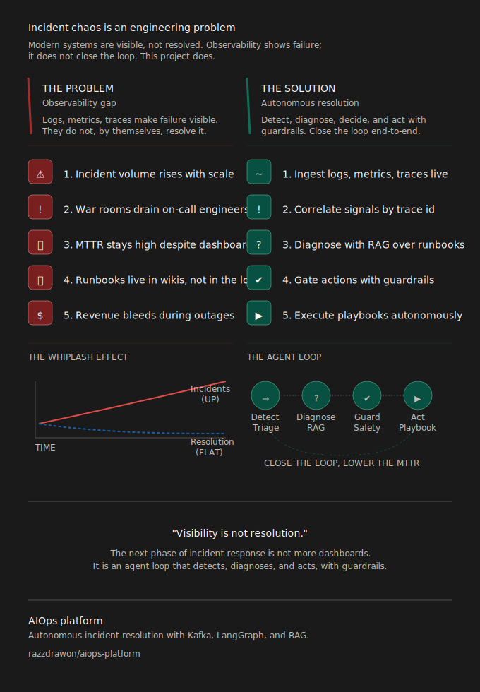
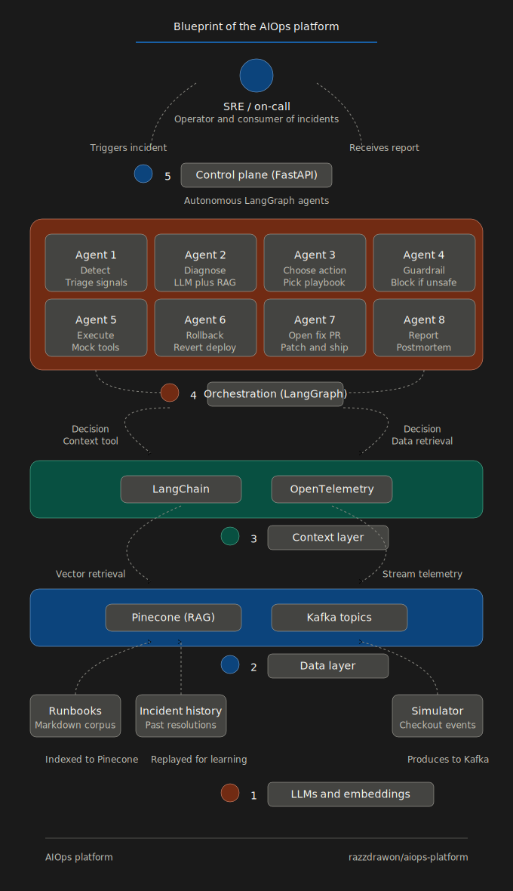

# AIOps Platform — Autonomous Incident Resolution

> Reduce MTTR and close incidents without humans — by combining streaming telemetry, RAG over internal runbooks, and a gated autonomous agent.

E-commerce platforms lose revenue every minute an incident stays open. This system ingests live logs, metrics, and traces, correlates them by `trace_id`, diagnoses the root cause with an LLM backed by a runbook knowledge base, and executes remediation — automatically, with guardrails.

**79% of simulated incidents resolved without human intervention. Average MTTR: 41 seconds.**

---



---

## What it does

| Stage | What happens |
|---|---|
| **Ingest** | Kafka consumer ingests streaming logs, metrics, and OTel traces from a live e-commerce simulator |
| **Correlate** | Events grouped by `trace_id` before diagnosis — signal quality over noise |
| **Diagnose** | LLM + RAG over Pinecone runbook index identifies root cause with a confidence score |
| **Gate** | Deterministic guardrails block destructive actions if `confidence ≤ 0.85` — LLM proposes, rules decide |
| **Act** | Agent executes rollback / restart / scale via tool registry; reports resolution |
| **Persist** | Every incident stored in PostgreSQL — MTTR and block rate computed from real data |

---

## Stack

**Python 3.11 · FastAPI · PostgreSQL · SQLAlchemy (async) · Kafka · LangGraph · Pinecone · OpenAI · Docker**

---

## Sample response

```json
{
  "incident_id": "fdb8936e-9a22-46fc-994d-de877f8eb500",
  "status": "resolved",
  "duration_ms": 13386,
  "graph": {
    "detector": { "classification": "high_error_rate", "severity_hint": "high" },
    "diagnosis": {
      "suspected_root_cause": "bad deployment or downstream dependency timeout",
      "matched_runbook_titles": ["high-error-rate.md"],
      "confidence": 0.8
    },
    "action": { "action": "create_pr_fix", "destructive": false, "confidence": 0.8 },
    "guardrail_result": { "blocked": false, "reason": "ok" },
    "execution": { "tool": "create_pr_fix", "message": "PR opened (mock)" }
  }
}
```

---

## Quick start

```bash
# 1. Clone and install
git clone git@github.com:razzdrawon/aiops-platform.git
cd aiops-platform
python3.11 -m venv .venv && source .venv/bin/activate
pip install -e ".[dev]"

# 2. Start PostgreSQL
docker-compose up -d db
alembic upgrade head

# 3. Run the API (offline mode — no API keys needed)
uvicorn app.api.main:app --port 8000 --reload

# 4. Trigger an incident
curl -s -X POST http://localhost:8000/incident \
  -H "Content-Type: application/json" \
  -d '{"title": "High error rate on checkout", "signals": {"error_rate": 0.12}}' \
  | python3 -m json.tool
```

For LLM mode, add `OPENAI_API_KEY` and `PINECONE_API_KEY` to `.env` and run `python -m app.knowledge.indexer` once to index the runbooks.

---

## Architecture

```
 SRE / on-call
   ↕  triggers incident · receives report
   
 ┌─────────────────────────────────────────────┐
 │  Control plane  ·  FastAPI                  │
 └─────────────────────────────────────────────┘
                        ↕
 ┌─────────────────────────────────────────────────────────────────┐
 │  Agent pipeline  ·  LangGraph                                   │
 │                                                                 │
 │  detect → diagnose → choose_action → guardrail → execute        │
 │                                          ↓                      │
 │                               rollback | fix_pr | scale         │
 │                                          ↓                      │
 │                                       report                    │
 └─────────────────────────────────────────────────────────────────┘
                        ↕
 ┌─────────────────────────────────────────┐
 │  Context layer                          │
 │  LangChain  ·  OpenTelemetry            │
 └─────────────────────────────────────────┘
                        ↕
 ┌─────────────────────────────────────────┐
 │  Data layer                             │
 │  Pinecone (RAG)  ·  Kafka topics        │
 └─────────────────────────────────────────┘
         ↑                    ↑
  Runbooks (Markdown)    Simulator → Kafka
  Incident history
                        ↕
 ┌─────────────────────────────────────────┐
 │  Foundation                             │
 │  OpenAI LLMs  ·  Embeddings             │
 └─────────────────────────────────────────┘
```



The guardrail node is deterministic Python — the LLM cannot override it.  
The pipeline runs fully offline (heuristic mode) when API keys are absent.

---

## API Endpoints

| Method | Endpoint | Description |
|---|---|---|
| `POST` | `/incident` | Run the full agent pipeline and persist the result |
| `GET` | `/incidents` | List all incidents |
| `GET` | `/incidents/{id}` | Get a single incident with full pipeline output |
| `GET` | `/metrics/summary` | MTTR average and guardrail block rate |
| `GET` | `/health` | Health check |

---

## Roadmap

| Phase | Focus | Status |
|---|---|---|
| 1 — Foundation | Clean architecture, PostgreSQL persistence, tests, CI | ✅ Complete |
| 2 — Evaluation Framework | Synthetic cases, accuracy/precision/recall measurement | ✅ Complete |
| 3 — Agent Observability | Token usage, cost per incident, latency per node | ✅ Complete |
| 4 — Streaming + Integrations | SSE streaming, PagerDuty webhooks, Slack notifications | ⏳ Next |
| 5 — Production Readiness | Prometheus metrics, Grafana dashboard, Redis caching, API key auth, rate limiting | 🗓 Planned |
| 6 — Cloud Deployment | Terraform (AWS ECS + RDS + MSK), multi-env config, secrets management, CD pipeline | 🗓 Planned |

Each phase is designed to demonstrate a distinct set of backend + AI engineering skills. See [docs/roadmap.md](docs/roadmap.md) for the full breakdown.

---


## Docs

- [Architecture evolution](docs/architecture-evolution.md)
- [Technical decisions](docs/technical-decisions.md)
- [Validation guide](docs/validation-guide.md)
- [Roadmap](docs/roadmap.md)
